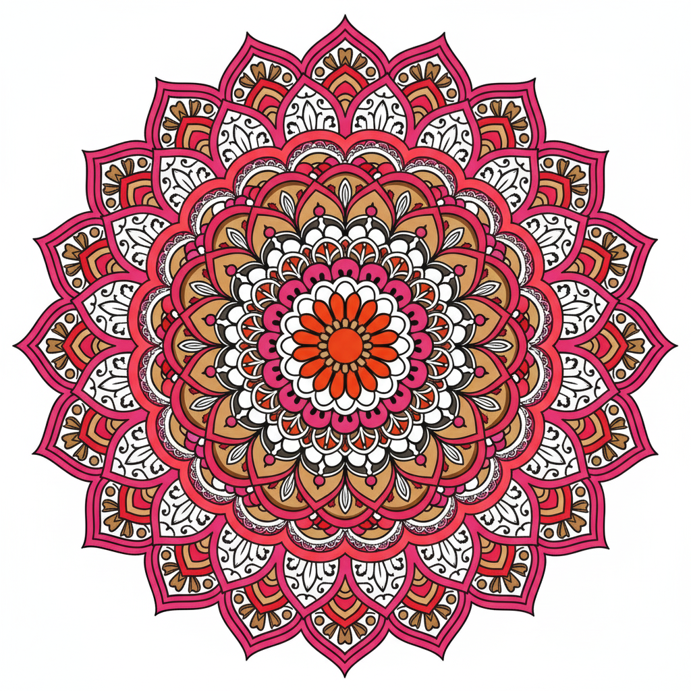
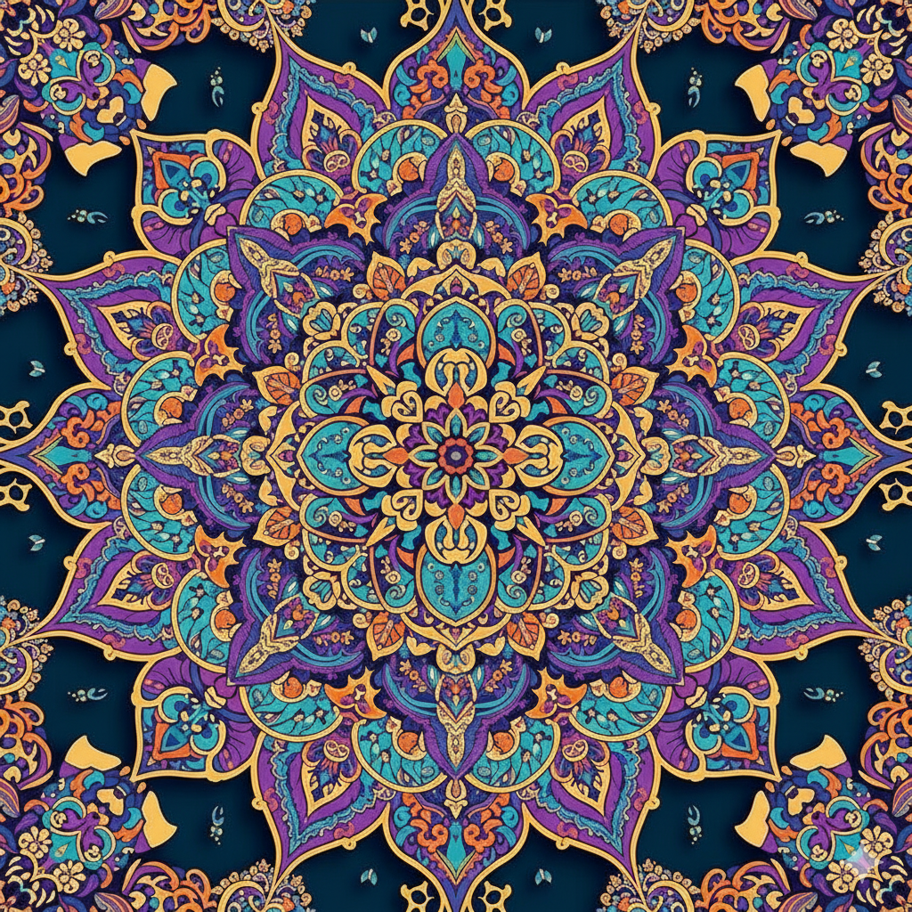
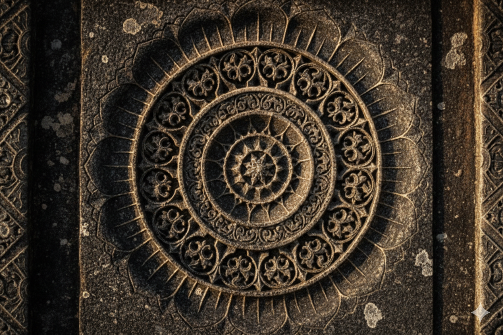
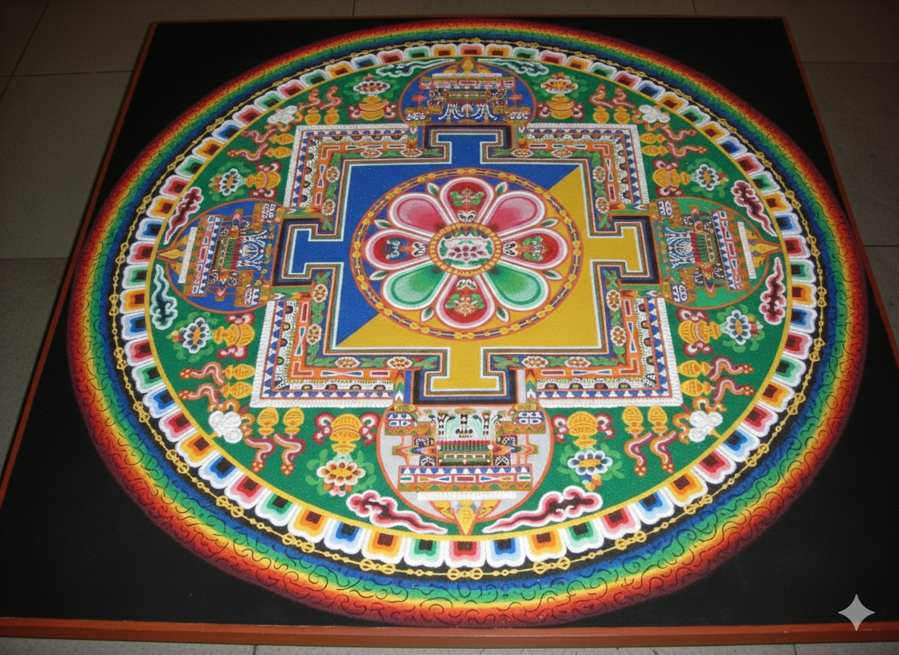
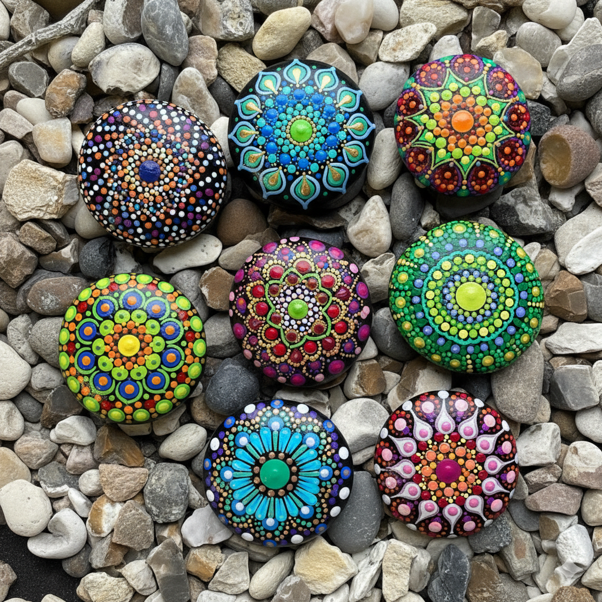
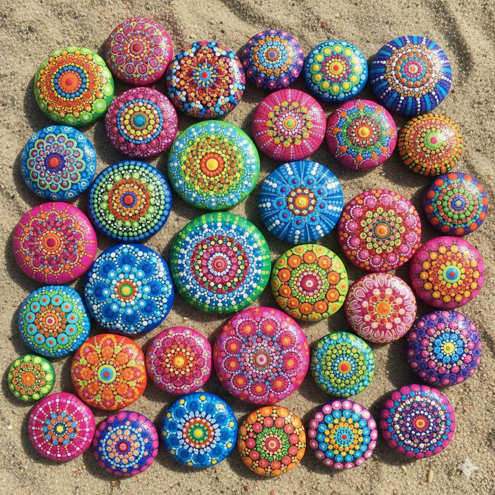

=======================================
Mandala Dot-Painting Workshop Petteflet
=======================================

Welcome to Mandala Dot-Painting! 🎨
===================================

What is a Mandala?
==================

A mandala is a special kind of circular art that looks like a beautiful, colorful flower or snowflake!
The word "mandala" comes from an ancient language called **Sanskrit**, and it means **"circle"**.
Mandalas are like magical circles filled with patterns that go round and round from the center —
kind of like ripples in a pond when you drop a pebble in the water!

Where Do Mandalas Come From?
============================

Mandalas have been around for **thousands of years!**
They started in faraway places like **India and Tibet**, where people created them as a special way
to think peaceful thoughts and feel calm. Monks and artists would spend days or even weeks
making incredibly detailed mandalas using colored sand, paint, or precious stones.

People in many different countries make mandalas – from Asia to Native American cultures.
Each culture has its own special style and meaning!

Different Types of Mandalas
===========================

There are so many kinds of mandalas! Some are:

Sand Mandalas
-------------

Made with colored sand (like a sand castle, but way fancier!)

.. image:: images/03_c_mandalawork_tibetanmonks.jpg
   :alt: Monks creating sand mandala
   :class: r-stretch
   :align: center

Painted Mandalas
----------------

Created with brushes and paint.

Stone Mandalas
--------------

Arranged with rocks and pebbles.

.. image:: images/05_stone_mandala.png
   :alt: Stone mandala with pebbles
   :class: r-stretch
   :align: center

Dot-Painted Mandalas
--------------------

Made with lots and lots of colorful dots (this is what we'll do today!).

Animated Mandalas
-----------------

.. raw:: html

   

       <video width="640" height="480" controls>
           <source src="https://www.shutterstock.com/shutterstock/videos/1097155757/preview/stock-footage-transforming-ornamental-abstract-mandala-seamless-loop-footage.webm" type="video/webm">
           Your browser does not support the video tag.
       </video>
   

   

       <video width="640" height="480" controls>
           <source src="https://www.shutterstock.com/shutterstock/videos/1009997564/preview/stock-footage-transforming-ornamental-vintage-background-abstract-footage-in-art-nouveau-style-round-mandala.webm" type="video/webm">
           Your browser does not support the video tag.
       </video>
   

   

       <video width="640" height="480" controls>
           <source src="https://www.shutterstock.com/shutterstock/videos/3789554509/preview/stock-footage-golden-mandala-pattern-radiating-abstract-light-spiritual-festival-background-animation-for-yoga.webm" type="video/webm">
           Your browser does not support the video tag.
       </video>
   

Nature mandalas
---------------

.. image:: images/alt/alt_1.png
   :alt: Nature
   :class: r-stretch
   :align: center

.. revealjs-break::
    :notitle:

.. image:: images/alt/alt_2.png
   :alt: Nature
   :class: r-stretch
   :align: center

.. revealjs-break::
    :notitle:

.. image:: images/alt/alt_3.png
   :alt: Nature
   :class: r-stretch
   :align: center

.. revealjs-break::
    :notitle:

.. image:: images/alt/alt_4.png
   :alt: Nature
   :class: r-stretch
   :align: center

.. revealjs-break::
    :notitle:

.. image:: images/alt/alt_5.png
   :alt: Nature
   :class: r-stretch
   :align: center
.. revealjs-break::
    :notitle:

.. image:: images/alt/alt_6.png
   :alt: Nature
   :class: r-stretch
   :align: center

Today's Adventure: Dot-Painting!
================================

Today, we're going to create our very own mandalas using the **dot-painting technique!**
This means we'll use special tools to make tiny, colorful dots that form beautiful patterns.
It's like connecting the dots, but **YOU** get to put the dots wherever you want to make your own unique design!

Ready to become mandala artists? Let's get started! 🌟

.. image:: images/steps/step_6.jpg
   :alt: What we're gonna make
   :class: r-stretch
   :align: center

License
=======

This project is licensed under the terms of the
Creative Commons Attribution-NonCommercial 4.0 International Public
License (CC-BY-NC 4.0).

For the full license terms, see the
`LICENSE <https://creativecommons.org/licenses/by-nc/4.0/>`_ file.

Author
======

Copyright (c) 2025, Artur Barseghyan <artur.barseghyan@gmail.com>.
All Rights Reserved.
